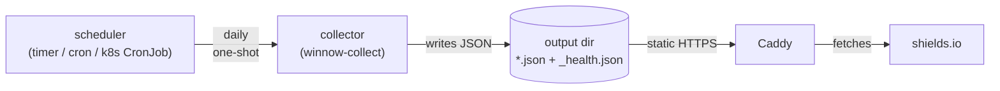

# Deploying pypi-winnow-downloads

This directory ships **example** configuration for the deployment paths
the collector was designed for. Copy what you need; nothing here is
prescriptive. Paths are placeholders (`/etc/pypi-winnow-downloads/`,
`/var/lib/pypi-winnow-downloads/output/`, host name `badges.example.com`)
— substitute your own.

## Architecture

The collector is a **one-shot** process: each run queries BigQuery via
`pypinfo`, writes shields.io endpoint JSON files per package to an
output directory, writes `_health.json` at the output root, and exits.
Scheduling happens outside the collector (systemd timer, host cron, k8s
CronJob, etc.).

A static HTTP server (Caddy in the canonical setup) serves the output
directory over HTTPS. shields.io fetches each badge's JSON from your
public URL and renders the badge image.



## Pick an approach

| Approach | What you copy | Pros | Cons |
| --- | --- | --- | --- |
| **Bare systemd** (Linux host or LXC) | `systemd/`, `caddy/Caddyfile.example` | Smallest moving parts. Predictable. Native journal logging. | Linux-only. Manual user/dir setup. |
| **Docker, host-scheduled** | `docker/Dockerfile`, host cron entry | Works anywhere Docker runs. No host Python. | Host scheduling required. No native log integration. |
| **Docker Compose** | `docker/Dockerfile`, `docker/compose.yml.example`, `caddy/Caddyfile.example` | Single declarative file. Caddy + collector together. | Compose has no scheduler — still need host cron. Two-step bring-up. |

The reference deployment is bare systemd inside an LXC container on
Proxmox. The Dockerfile and Compose example are provided for self-hosters
on different stacks.

## Bare systemd (recommended for most self-hosts)

Files:
- [`systemd/pypi-winnow-downloads-collector.service`](systemd/pypi-winnow-downloads-collector.service) — `Type=oneshot` unit
- [`systemd/pypi-winnow-downloads-collector.timer`](systemd/pypi-winnow-downloads-collector.timer) — daily timer
- [`caddy/Caddyfile.example`](caddy/Caddyfile.example) — HTTPS static serving

Quick start (Debian-family; adjust as needed):

```bash
# Install the package (PyPI or wheel from this repo).
pip install pypi-winnow-downloads
# or: pip install dist/pypi_winnow_downloads-<version>-py3-none-any.whl

# Service user + dirs.
sudo useradd --system --shell /usr/sbin/nologin --home-dir /var/lib/pypi-winnow-downloads winnow
sudo install -d -o winnow -g winnow -m 0755 /var/lib/pypi-winnow-downloads/output
sudo install -d -o root   -g winnow -m 0750 /etc/pypi-winnow-downloads

# Drop in config + credential (mode 0640, group=winnow so the service
# can read but other users on the host can't).
sudo install -m 0640 -o root -g winnow config.yaml /etc/pypi-winnow-downloads/
sudo install -m 0640 -o root -g winnow gcp.json    /etc/pypi-winnow-downloads/

# Install the systemd units.
sudo cp systemd/pypi-winnow-downloads-collector.service /etc/systemd/system/
sudo cp systemd/pypi-winnow-downloads-collector.timer   /etc/systemd/system/
sudo systemctl daemon-reload
sudo systemctl enable --now pypi-winnow-downloads-collector.timer

# Run once now to verify (don't wait for the timer).
sudo systemctl start pypi-winnow-downloads-collector.service
sudo journalctl -u pypi-winnow-downloads-collector.service -n 100

# Caddy.
sudo BADGE_HOST=badges.example.com cp caddy/Caddyfile.example /etc/caddy/Caddyfile
# (or edit the file directly to inline your hostname — see comments inside)
sudo systemctl reload caddy

# Smoke-check the badge URL.
curl -sI https://badges.example.com/<package>/downloads-30d-non-ci.json
```

Make sure ports 80 and 443 reach Caddy from the public internet (router
port-forward, host firewall, etc.) before reloading Caddy on the public
hostname — the first request triggers a Let's Encrypt ACME order, which
will fail if HTTP-01 can't reach the box.

## Docker, host-scheduled

Files:
- [`docker/Dockerfile`](docker/Dockerfile) — multi-stage, non-root

Build and run:

```bash
docker build -f deploy/docker/Dockerfile -t pypi-winnow-downloads:dev .

# One-off run (writes badges to a Docker volume).
docker run --rm \
  -v "$PWD/config.yaml:/etc/pypi-winnow-downloads/config.yaml:ro" \
  -v "$PWD/gcp.json:/etc/pypi-winnow-downloads/gcp.json:ro" \
  -v badge_output:/var/lib/pypi-winnow-downloads/output \
  -e GOOGLE_APPLICATION_CREDENTIALS=/etc/pypi-winnow-downloads/gcp.json \
  pypi-winnow-downloads:dev

# Schedule via host cron (example: 04:30 every day).
30 4 * * * docker run --rm \
  -v /srv/pwd/config.yaml:/etc/pypi-winnow-downloads/config.yaml:ro \
  -v /srv/pwd/gcp.json:/etc/pypi-winnow-downloads/gcp.json:ro \
  -v badge_output:/var/lib/pypi-winnow-downloads/output \
  -e GOOGLE_APPLICATION_CREDENTIALS=/etc/pypi-winnow-downloads/gcp.json \
  pypi-winnow-downloads:dev
```

Serve the output directory with whatever HTTPS-terminating server you
already run; the Caddyfile example works as a starting point.

## Docker Compose

Files:
- [`docker/Dockerfile`](docker/Dockerfile)
- [`docker/compose.yml.example`](docker/compose.yml.example)
- [`caddy/Caddyfile.example`](caddy/Caddyfile.example)

Compose pairs the collector (one-shot, behind the `run-once` profile) and
Caddy (long-running, restart=unless-stopped) sharing a named volume:

```bash
cp docker/compose.yml.example compose.yml
cp caddy/Caddyfile.example Caddyfile
# Edit compose.yml to set BADGE_HOST, mount points, etc.

# Bring up Caddy.
BADGE_HOST=badges.example.com docker compose up -d caddy

# Run the collector once (also schedule from host cron).
docker compose --profile run-once run --rm collector
```

## Required environment

Whichever approach you pick, the collector needs:

- **`GOOGLE_APPLICATION_CREDENTIALS`** pointing at a GCP service-account
  JSON with `BigQuery Job User` + `BigQuery Data Viewer` roles. (`pypinfo`
  consults this env var on the no-flag path.)
- A YAML config file matching [`../config.example.yaml`](../config.example.yaml).
- Write access to `output_dir` from the config.

The collector overrides `XDG_DATA_HOME` per invocation, so any prior
`pypinfo -a <path>` state on the host is ignored — no need to clean up
`~/.local/share/pypinfo/` before deploying.

## Caveats

- **shields.io's CDN caches endpoint responses for hours**, regardless of
  your `Cache-Control`. Don't expect the badge to update the moment your
  collector finishes; allow up to a few hours for shields.io to refetch.
- **`details.ci` is imperfect.** It's the BigQuery field pip populates
  when it detects a CI environment variable. Misses CI environments pip
  doesn't recognize; falsely flags dev containers that export `CI=true`.
  The badge filter is meaningfully better than no filter, not perfect.
- **Downloads ≠ installs ≠ usage.** The badge measures downloads (a
  Linehaul row per file fetch). Don't conflate it with installs (no
  telemetry) or "real users" (also no telemetry).
