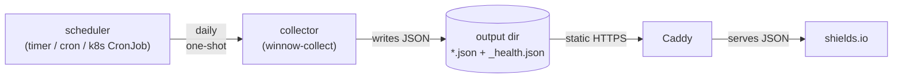

# Deploying pypi-winnow-downloads

This directory ships **example** configuration for the deployment paths
the collector was designed for. Copy what you need; nothing here is
prescriptive. Paths are placeholders (`/etc/pypi-winnow-downloads/`,
`/var/lib/pypi-winnow-downloads/output/`, host name `badges.example.com`)
— substitute your own.

## Architecture

The collector is a **one-shot** process: each run queries BigQuery via
`pypinfo`, writes shields.io endpoint JSON files per package to an
output directory, writes `_health.json` at the output root, and exits.
Scheduling happens outside the collector (systemd timer, host cron, k8s
CronJob, etc.).

A static HTTP server (Caddy in the canonical setup) serves the output
directory over HTTPS. shields.io fetches each badge's JSON from your
public URL and renders the badge image.



## Pick an approach

| Approach | What you copy | Pros | Cons |
| --- | --- | --- | --- |
| **Bare systemd** (Linux host or LXC) | `systemd/`, `caddy/Caddyfile.example` | Smallest moving parts. Predictable. Collector logs to journal; Caddy logs to rotated files under `/var/log/caddy/`. | Linux-only. Manual user/dir setup. |
| **Docker, host-scheduled** | `docker/Dockerfile`, host cron entry | Works anywhere Docker runs. No host Python. | Host scheduling required. No native log integration. |
| **Docker Compose** | `docker/Dockerfile`, `docker/compose.yml.example`, `caddy/Caddyfile.example` | Single declarative file. Caddy + collector together. | Compose has no scheduler — still need host cron. Two-step bring-up. |

The reference deployment is bare systemd inside an LXC container on
Proxmox. The Dockerfile and Compose example are provided for self-hosters
on different stacks.

If you'd rather skip Caddy + DDNS + router port-forwarding entirely,
see [**Alternative HTTPS exposure: Tailscale
Funnel**](#alternative-https-exposure-tailscale-funnel) below — that
section is orthogonal to which runtime above you pick.

## Bare systemd (recommended for most self-hosts)

Files:
- [`systemd/pypi-winnow-downloads-collector.service`](systemd/pypi-winnow-downloads-collector.service) — `Type=oneshot` unit
- [`systemd/pypi-winnow-downloads-collector.timer`](systemd/pypi-winnow-downloads-collector.timer) — daily timer
- [`caddy/Caddyfile.example`](caddy/Caddyfile.example) — HTTPS static serving

Quick start (Debian-family; adjust as needed):

```bash
# Install the package. Recommended: an isolated venv at /opt/ so the
# package + its runtime deps don't fight host system Python packaging.
sudo python3 -m venv /opt/pypi-winnow-downloads
sudo /opt/pypi-winnow-downloads/bin/pip install pypi-winnow-downloads
# or, from a local wheel:
# sudo /opt/pypi-winnow-downloads/bin/pip install dist/pypi_winnow_downloads-<version>-py3-none-any.whl

# Symlink the CLI entry point onto the system PATH so the systemd unit's
# ExecStart=/usr/local/bin/winnow-collect resolves. The collector finds
# pypinfo via sys.executable's neighbor (no PATH dependency), so a
# parallel pypinfo symlink isn't required — though you can add one if
# you want pypinfo on your shell's PATH for ad-hoc queries.
sudo ln -sf /opt/pypi-winnow-downloads/bin/winnow-collect /usr/local/bin/winnow-collect

# Service user + dirs.
sudo useradd --system --shell /usr/sbin/nologin --home-dir /var/lib/pypi-winnow-downloads winnow
sudo install -d -o winnow -g winnow -m 0755 /var/lib/pypi-winnow-downloads/output
sudo install -d -o root   -g winnow -m 0750 /etc/pypi-winnow-downloads

# Drop in config + credential (mode 0640, group=winnow so the service
# can read but other users on the host can't).
sudo install -m 0640 -o root -g winnow config.yaml /etc/pypi-winnow-downloads/
sudo install -m 0640 -o root -g winnow gcp.json    /etc/pypi-winnow-downloads/

# Install the systemd units.
sudo cp systemd/pypi-winnow-downloads-collector.service /etc/systemd/system/
sudo cp systemd/pypi-winnow-downloads-collector.timer   /etc/systemd/system/
sudo systemctl daemon-reload
sudo systemctl enable --now pypi-winnow-downloads-collector.timer

# Run once now to verify (don't wait for the timer).
sudo systemctl start pypi-winnow-downloads-collector.service
sudo journalctl -u pypi-winnow-downloads-collector.service -n 100

# Caddy.
sudo BADGE_HOST=badges.example.com cp caddy/Caddyfile.example /etc/caddy/Caddyfile
# (or edit the file directly to inline your hostname — see comments inside)
sudo systemctl reload caddy

# Smoke-check the badge URL.
curl -sI https://badges.example.com/<package>/downloads-30d-non-ci.json
```

Make sure ports 80 and 443 reach Caddy from the public internet (router
port-forward, host firewall, etc.) before reloading Caddy on the public
hostname — the first request triggers a Let's Encrypt ACME order, which
will fail if HTTP-01 can't reach the box.

## Docker, host-scheduled

Files:
- [`docker/Dockerfile`](docker/Dockerfile) — multi-stage, non-root

Build and run:

```bash
docker build -f deploy/docker/Dockerfile -t pypi-winnow-downloads:dev .

# One-off run (writes badges to a Docker volume).
docker run --rm \
  -v "$PWD/config.yaml:/etc/pypi-winnow-downloads/config.yaml:ro" \
  -v "$PWD/gcp.json:/etc/pypi-winnow-downloads/gcp.json:ro" \
  -v badge_output:/var/lib/pypi-winnow-downloads/output \
  -e GOOGLE_APPLICATION_CREDENTIALS=/etc/pypi-winnow-downloads/gcp.json \
  pypi-winnow-downloads:dev

# Schedule via host cron (example: 04:30 every day).
30 4 * * * docker run --rm \
  -v /srv/pwd/config.yaml:/etc/pypi-winnow-downloads/config.yaml:ro \
  -v /srv/pwd/gcp.json:/etc/pypi-winnow-downloads/gcp.json:ro \
  -v badge_output:/var/lib/pypi-winnow-downloads/output \
  -e GOOGLE_APPLICATION_CREDENTIALS=/etc/pypi-winnow-downloads/gcp.json \
  pypi-winnow-downloads:dev
```

Serve the output directory with whatever HTTPS-terminating server you
already run; the Caddyfile example works as a starting point.

## Docker Compose

Files:
- [`docker/Dockerfile`](docker/Dockerfile)
- [`docker/compose.yml.example`](docker/compose.yml.example)
- [`caddy/Caddyfile.example`](caddy/Caddyfile.example)

Compose pairs the collector (one-shot, behind the `run-once` profile) and
Caddy (long-running, restart=unless-stopped) sharing a named volume:

```bash
cp docker/compose.yml.example compose.yml
cp caddy/Caddyfile.example Caddyfile
# Edit compose.yml to set BADGE_HOST, mount points, etc.

# Bring up Caddy.
BADGE_HOST=badges.example.com docker compose up -d caddy

# Run the collector once (also schedule from host cron).
docker compose --profile run-once run --rm collector
```

## Alternative HTTPS exposure: Tailscale Funnel

If you don't want to maintain Caddy + Let's Encrypt + DDNS + router
port-forwarding, [Tailscale Funnel](https://tailscale.com/kb/1223/funnel)
is a drop-in replacement for the public-HTTPS layer. Funnel routes
inbound traffic from the public internet through Tailscale's relay to
a port on your machine, with HTTPS terminated by Tailscale.

This is orthogonal to the three runtime approaches above — the
collector still runs as a systemd timer, host-cron'd Docker, or
Compose `run-once`. Only the HTTPS-front-door changes. No files in
this repo are specific to Funnel; Tailscale is configured via its
CLI.

**When to pick Funnel over Caddy + DDNS:**

- Your router doesn't allow port-forwarding 80/443 (CGNAT, ISP
  policy, work / dorm / coffee-shop network).
- You'd rather not run an ACME flow on a residential IP that
  rotates.
- You'd rather not expose your home IP in public DNS.
- You already run Tailscale and want one fewer moving part.

**Trade-offs vs the canonical Caddy + DDNS setup:**

- **URL is `<device>.<tailnet>.ts.net`** on the free Personal plan,
  locked to your tailnet. Custom domains (`badges.example.com`)
  require a paid plan. shields.io itself doesn't care what hostname
  it polls; the badge URL just embeds the tailnet name and the
  `<package>/downloads-30d-non-ci.json` path is unchanged.
- **Funnel's public-facing HTTPS port must be 443, 8443, or 10000.**
  The local service can listen on any port.
- **Bandwidth limits exist** (Tailscale doesn't publish exact
  figures). For a once-per-day JSON cached at shields.io's CDN this
  is a non-issue; high-traffic services should test first.
- **One more daemon to keep updated** — `tailscale` on the deploy
  host.
- **End-to-end encrypted.** Tailscale's relays cannot decrypt
  traffic; your home IP stays hidden from clients.

**Setup with bare systemd (one localhost file server + one funnel
command):**

```bash
# 1. Install Tailscale on the host.
curl -fsSL https://tailscale.com/install.sh | sh
sudo tailscale up

# 2. Serve output_dir on a localhost port. Python's built-in server
#    bound to 127.0.0.1 is the simplest option; Caddy or any other
#    static-file server works equally well as long as it's
#    localhost-only.
sudo systemd-run --unit=winnow-fileserver \
  --working-directory=/var/lib/pypi-winnow-downloads/output \
  python3 -m http.server 8443 --bind 127.0.0.1

# 3. Enable Funnel for the localhost port.
sudo tailscale funnel --bg http://127.0.0.1:8443

# 4. Find the public URL.
sudo tailscale funnel status
# https://<device>.<tailnet>.ts.net is now live, serving output_dir.

# 5. Smoke-check.
curl -sI https://<device>.<tailnet>.ts.net/<package>/downloads-30d-non-ci.json
```

The collector unit + timer from the **Bare systemd** section above
remain unchanged. Skip the `sudo systemctl reload caddy` step and the
router port-forward; Tailscale handles the rest.

**Update the badge URL** in your README to point at the Funnel
hostname (URL-encode the embedded `https://`):

```markdown
[](https://pypi.org/project/<package>/)
```

**Tear down:**

```bash
sudo tailscale funnel --https=443 off
sudo systemctl stop winnow-fileserver
```

Funnel only forwards while enabled; disabling immediately returns the
box to tailnet-internal-only access.

## Required environment

Whichever approach you pick, the collector needs:

- **`GOOGLE_APPLICATION_CREDENTIALS`** pointing at a GCP service-account
  JSON with `BigQuery Job User` + `BigQuery Data Viewer` roles. (`pypinfo`
  consults this env var on the no-flag path.)
- A YAML config file matching [`../config.example.yaml`](../config.example.yaml).
- Write access to `output_dir` from the config.

The collector overrides `XDG_DATA_HOME` per invocation, so any prior
`pypinfo -a <path>` state on the host is ignored — no need to clean up
`~/.local/share/pypinfo/` before deploying.

## Caveats

- **shields.io's CDN caches endpoint responses for hours**, regardless of
  your `Cache-Control`. Don't expect the badge to update the moment your
  collector finishes; allow up to a few hours for shields.io to refetch.
- **`details.ci` is imperfect.** It's the BigQuery field pip populates
  when it detects a CI environment variable. Misses CI environments pip
  doesn't recognize; falsely flags dev containers that export `CI=true`.
  The badge filter is meaningfully better than no filter, not perfect.
- **The installer allowlist is fail-closed.** The hero badge counts only
  rows whose `details.installer.name` is in
  `{pip, uv, poetry, pdm, pipenv, pipx}` — the interactive Python
  packaging-tool family. A future installer not in that set will be
  silently excluded until the constant in
  `src/pypi_winnow_downloads/collector.py` is updated. That's intentional
  for a project whose pitch is honesty (better to undercount than to
  silently sweep in a new traffic source), but it does mean operators
  should re-evaluate the allowlist when a new mainstream packaging tool
  shows up.
- **Downloads ≠ installs ≠ usage.** The badge measures downloads (a
  Linehaul row per file fetch). Don't conflate it with installs (no
  telemetry) or "real users" (also no telemetry).
